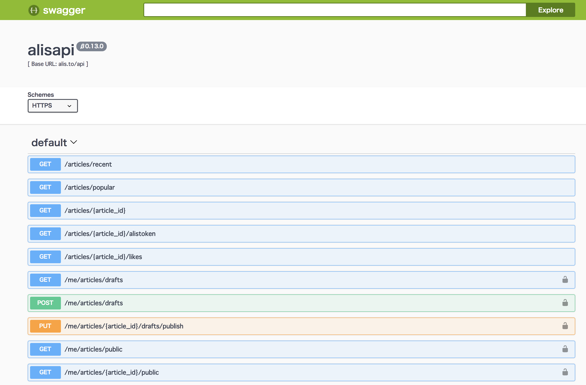
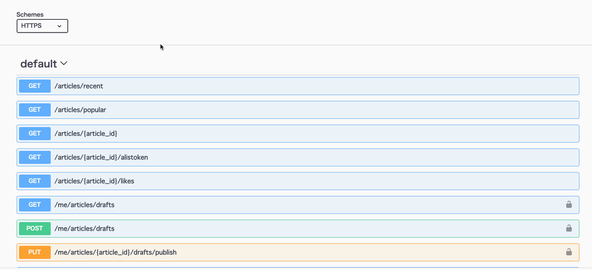

ALIS APIドキュメント
===
[](https://alis.to)  

[ALIS](https://alis.to)が公開するAPIについてのドキュメントです。  

# APIエンドポイントの詳細情報
- https://alisproject.github.io/api-docs  
[](https://alisproject.github.io/api-docs)


# 利用方法
API利用方法を記載します。
このドキュメントでは以下の環境で動作確認をしています。

- macOS High Sierra

## 人気記事の一覧を取得する例
人気記事の一覧を1件取得するリクエストを例にして利用方法を説明します。

### 該当APIエンドポイント
- https://alisproject.github.io/api-docs/#/default/get_articles_popular

### コマンド
```bash
curl -X GET "https://alis.to/api/articles/popular?limit=1" -H "accept: application/json"
```

### レスポンス
```json
{"Items": [{"user_id": "moukonjoshi", "created_at": 1529964744, "overview": "\u306f\u3044\u304a\u306f\u3088\u3046\u3054\u3056\u3044\u307e\u3059\u3081\u3061\u3083\u7720\u3044\u3067\u304a\u99b4\u67d3\u307f\u6bdb\u6839\u5973\u5b50\u3067\u3054\u3056\u3044\u307e\u3059\u3055\u3042\u3066\u3055\u3066\u4eca\u65e5\u671d\u5bb6\u3067\u308b\u524d\u306b\u30ab\u30d0\u30f3\u304c\u30d1\u30f3\u30d1\u30f3\u3060\u3063\u305f\u306e\u3067\u3044\u3089\u306a\u3044\u3082\u306e\u3092\u6368\u3066\u3066\u3044\u305f\u3093\u3067\u3059\u306d\u3059\u308b\u3068\u4e2d\u304b\u3089\u4f55\u6545\u304b\u5927\u91cf\u306e\u7c73\u304c\u3067\u3066\u304d\u305f\u3093\u3067\u3059\u3088\u306a\u3093\u304b\u306e\u546a", "status": "public", "eye_catch_url": "https://alis.to/d/api/articles_images/moukonjoshi/2APOAezNXzNr/08ecbd59-af46-4937-84ca-240f3831ada3.png", "sort_key": 1529965459183534, "article_id": "2APOAezNXzNr", "published_at": 1529965459, "title": "\u6bdb\u6839\u4f8d\u7b2c2\u90e81\u8a71\u30d3\u30c3\u30c8\u30b3\u30a4\u30f3\u30c1\u30e5\u30a6"}], "LastEvaluatedKey": {"evaluated_at": 1529993420358003, "article_id": "2APOAezNXzNr", "score": 51}}
```

※日本語などのマルチバイト文字はUnicode Escape Sequenceでエンコードされているためデコードする必要があります。

## 認証が必要な API の実行例
認証が必要な API を実行する場合は、多少実装が必要になるため下記のサンプルをご確認ください（ログインユーザ情報を取得するサンプルです）。
- [サンプル](https://github.com/keillera/alis-api-sample/blob/master/exec_api_with_auth_sample.py)

### コマンドの作成
ドキュメントの該当箇所で以下のように操作すると上記で使用したコマンドが作成できます。


# SDK
コミュニティ作成のSDKが存在します。

- [Node.js](https://github.com/alisista/alis) (thanks to [@ocrybit](https://github.com/ocrybit))
- [Python](https://github.com/alisista/py-alis) (thanks to [@hoosan](https://github.com/hoosan))
- [Go](https://github.com/alisista/go-alis-client) (thanks to [@winor30](https://github.com/winor30))

# コミュニティ
- [公式Discord](https://discordapp.com/invite/b6T44q3)
  - ALIS公式のDiscordコミュニティです。
- [ALIS Supporters](https://discordapp.com/invite/kSTAkuT)
  - 非公式Discordコミュニティ。#ハッカー部 という部屋があります。
- [ALIS Hacker's Club](https://github.com/alisista)
  - ALIS Hacker's Club GitHubリポジトリ。

# API利用における注意事項
- [ALIS利用規約](https://alis.to/terms)の範囲内で利用してください
- 現状は特にリクエスト回数の制限等はありません
    - しかし過大な負荷や悪意あるリクエストが多発するなどした場合には制限を設ける予定です
    - 必ずHTTPステータスを確認し、4xxになるアクセスは除却してください。
- CORSは許可していません
    - 他ドメインのフロントエンドからのAPI利用はできません
- フィードバックは[公式Discord](https://discordapp.com/invite/b6T44q3)へよろしくお願いします
- 本ドキュメントのライセンス: [CC4](https://creativecommons.org/licenses/by/4.0/deed.ja)
